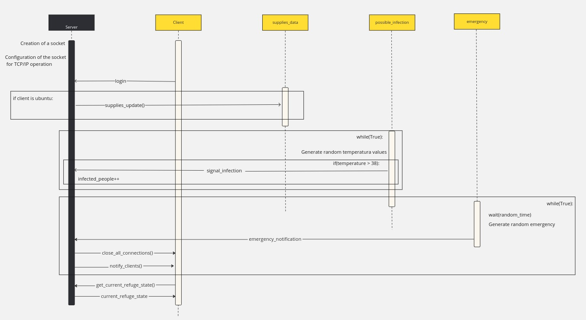

The project consists of the following files:

- **server.c:** The central server provides a refuge state summary in JSON format, facilitating access to key information on alerts, supplies, and emergency notifications for people. Clients connect via a simple login, providing a username and password. Initially, communication via sockets is done using TCP/IP and ipv4. UDP and ipv6 will be implemented in future releases. When the server starts, it creates and configures a socket for TCP/IP operation. Then, the fork() function is called twice to create two child processes. One of these children executes the functions of the possible_infection module and the other executes the functions of the emergency module. The main server process receives notifications from the "possible_infection" and "emergency" modules. Upon an emergency notification from "emergency.c", the server closes all connections and notifies all clients, and upon a notification coming from the possible_infection module, the server updates the refuge state summary with the new amount of infected people. These notifications are implemented through signals.
 Authentication is performed, allowing only the client "ubuntu" to update the supplies_data module. Other clients can only query the current state of the refuge. Child processes are created to handle communication with each client.
The server will keep a log file with all the events that happen in the refuge. This file will be in the /var/log/ directory, and the name will be refuge.log.

- **client.c:** It can be instantiated multiple times and simulates people seeking the refuge's current state summary. Each client has a unique username and password, with a special client "ubuntu" dedicated to updating supply information without querying the server. This ubuntu client simulates a privileged user with a strong password. User credentials are provided as command-line arguments.

- **possible_infection.c:** This module implements instant alerts for possible infected refugees. To simulate people's temperature measurements, random values between 36 and 40 degrees are used. If the random temperature value generated is greater than or equal to 38 degrees, it is considered that the person may be infected and an alert is sent. These alerts are implemented through signals. It is implemented as a static library. 
  The simulated temperatures are recorded in a log file named "infections.log". These logs are stored in a directory named "infection_logs".

- **supplies_data.c:** This module manages and updates information on available supplies, with updates initiated by the "ubuntu" client. Server-side authentication determines whether the requesting client is "ubuntu". This module is implemented as a static library. The functions from this library are called from the server when an ubuntu client is identified.

- **emergency.c:** This module generates instant emergency notifications, simulating power outages and critical situations with random periodic notifications. In this first version, two types of notifications are sent: "power outages" and "other critical situations". The notification sent is randomly chosen and implemented using signals. This module is implemented as a dynamic library.

Below is the sequence diagram of the project.

